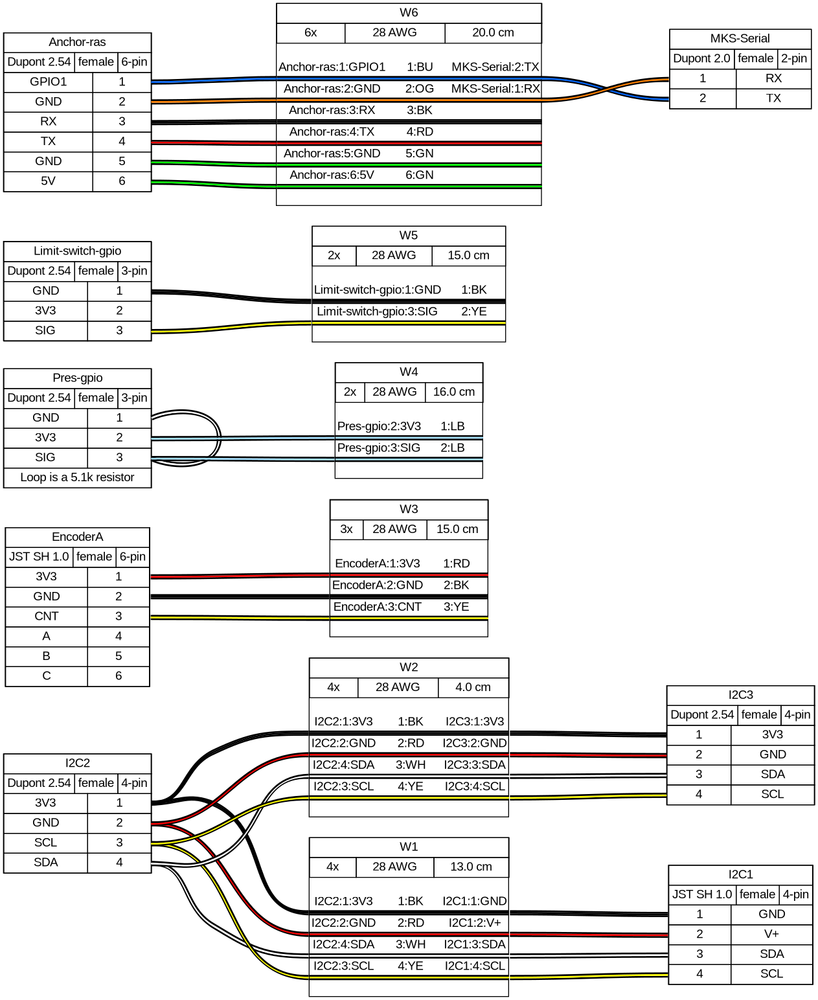
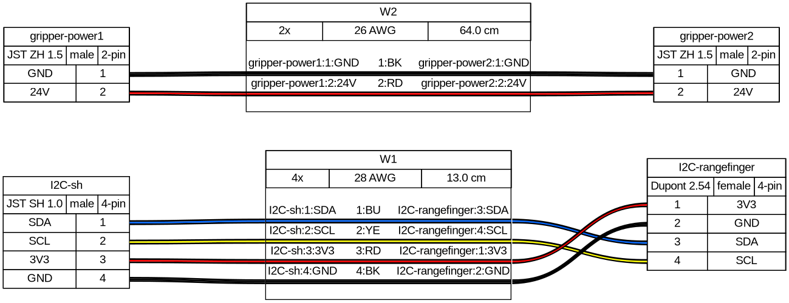

# Wire guide

Stringman's custom wires are described in [`guides/docs/wires/wires.yml`](wires/wires.yml) in this repository.

If creating them from scratch, you would need a connector kit and a crimping tool. However using a crimping tool can be really error prone without practice, and certain wires in this set could be made with the help of [pre-crimped wire tails](https://www.aliexpress.us/item/3256807689754798.html) 

## Pilot Gripper and Anchors

{ loading=lazy, width=100% }

## Arpeggio Gripper

I2C connector for the rangefinder
    stemma (4p JST ZH) format plug to 4p dupont 2.54 female in the pin order that matches the rangefinder

Power line that goes inside the ABS pole.
    66cm red-black power line with male JST-ZH connectors at both ends. 15cm

Pressure sense connector
    2p JST-SH connector with 20cm of wire and bare leads at the other end.

{ loading=lazy, width=100% }
