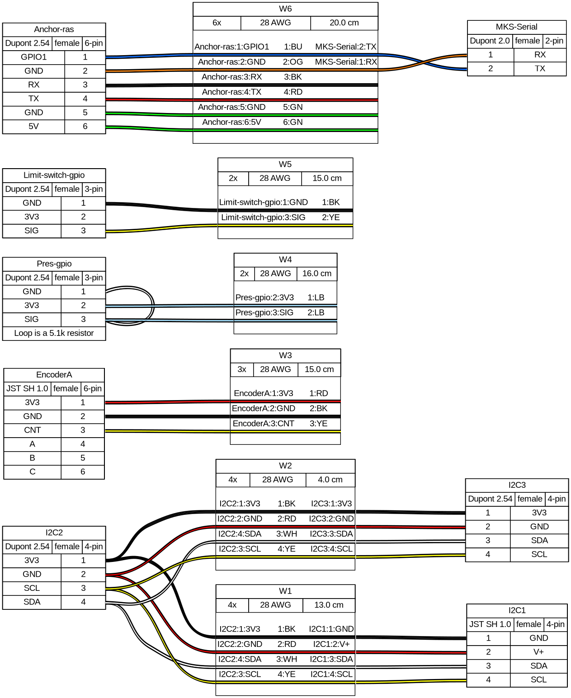
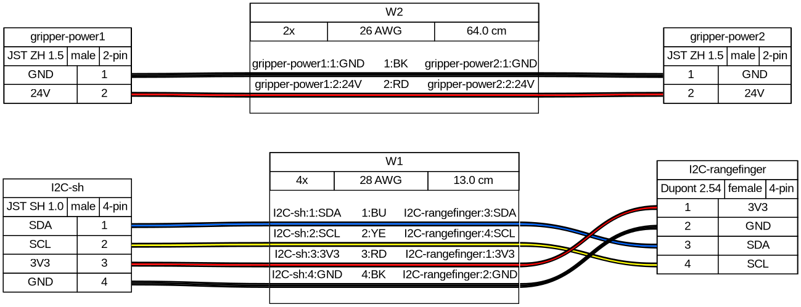

# Wire guide

Stringman's custom wires are described in `guides/docs/wires/` in this repository.

If creating them from scratch, you would need a connector kit and a crimping tool. However using a crimping tool can be really error prone without practice, and certain wires in this set could be made with the help of [pre-crimped wire tails](https://www.aliexpress.us/item/3256807689754798.html) 

## Pilot Gripper and Anchors

{ loading=lazy, width=100% }

## Arpeggio Gripper

I2C connector for the rangefinder
    4p JST ZH female aka "housing" to 4p dupont 2.54 female in the pin order that matches the rangefinder

Power line that goes inside the ABS pole.
    64cm red-black power line with male JST-ZH connectors at both ends.

Pressure sense connector
    2p JST-SH connector with 20cm of wire to bare leads soldered to the pressure sensor and protected with heat shrink.

{ loading=lazy, width=100% }
